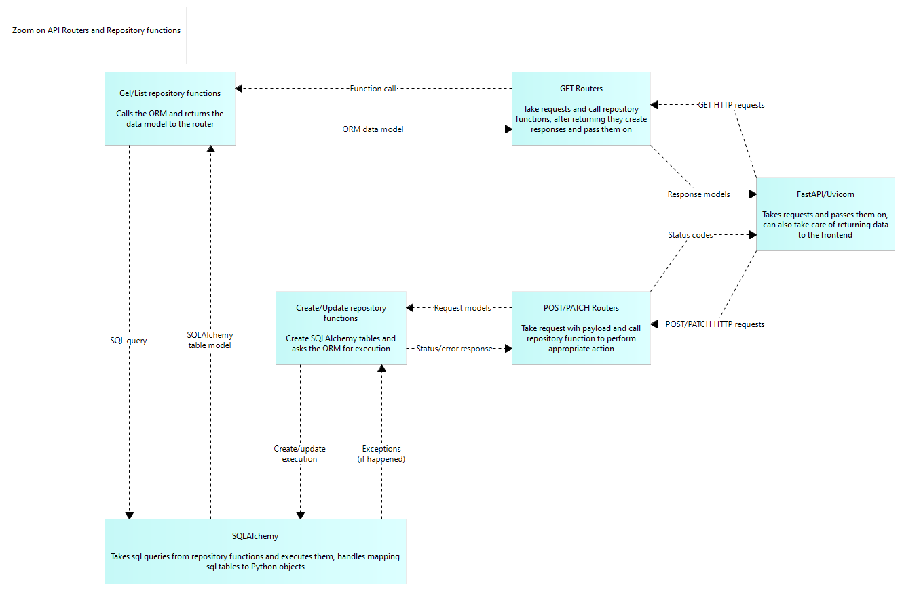

## Architektura - konsultacje śródsemestralne
### Poniżej zamieszczamy schemat C4, który przedstawiliśmy do oceny Panu dr. inż. Andrzejowi Ratkowskiemu

### C1 - Context

### C2 - Containers

### C3 - Components

### C4 - Code

