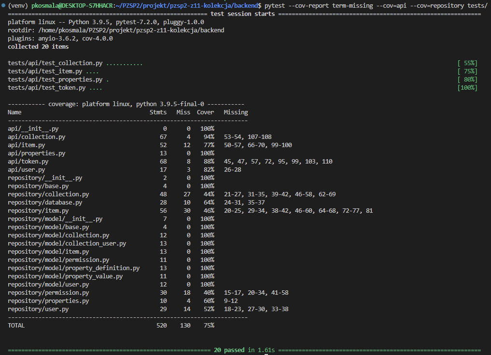

# Ocena końcowa - oprogramowanie/integracja

# Stan na dzień 9.01.2023 r.

## Kolekcja - opis tematu
Aktualne trendy rosnącej świadomości konsumenckiej widać w
zainteresowaniach i potrzebie sprzedaży/ zakupu rzeczy używanych, czy też
pozyskiwania/ pozbywania się ich w alternatywny sposób (recykling,
oddawanie). Zbuduj narzędzie wspomagające indywidualnego użytkownika/
grupę domowników przy inwentaryzacji i obrocie przedmiotami używanymi.
System powinien ułatwiać analizę kolekcji ze względu na różne kryteria
(kategoria, wartość, stan, etc.), wspomagać jej wizualizację oraz ułatwiać
lokalizację.

## Podstawowe funkcjonalności
* Tworzenie, usuwanie kolekcji
* Dodawanie użytkowników do zarządzania kolekcją z odpowiednimi uprawnieniami
* Dodawanie przedmiotów do kolekcji z informacjami o nich:
    * wartość
    * stan
    * kategoria
    * lokalizacja główna
    * lokalizacja tymczasowa (np. w przypadku pożyczenia przedmiotu)
    * zdjęcie
* Usuwanie przedmiotów, możliwość aktualizacji cech
* Wyszukiwanie przedmiotów ze względu na ich cechy
* Wyświetlanie liczby posiadanych przedmiotów z poszczególnych kategorii
* Ułatwienie sprzedaży przedmiotu na zewnętrznym serwisie (np. OLX, Allegro)
* Wygodne przeglądanie zawartości kolekcji

## Testy jednostkowe
W ramach projektu zrealizowane zostały testy jednostkowe w liczbie XX dla endpointów istniejących w aplikacji, uzyskując pokrycie równe XX% dla XXX linii kodu, poniżej przedstawiamy wyjście z programu pytest-cov:

## Diagram klas UML

