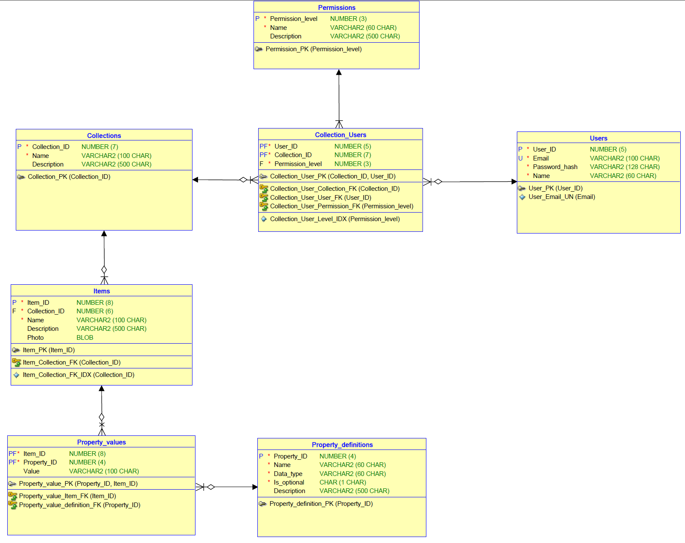
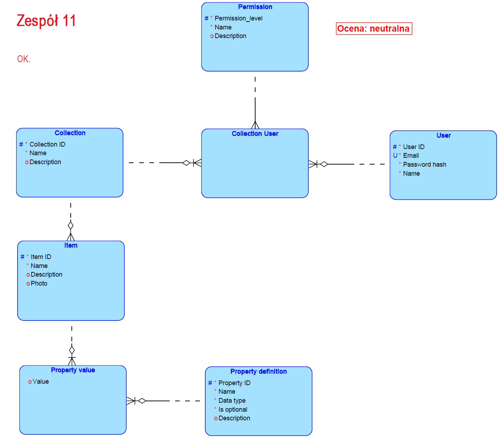
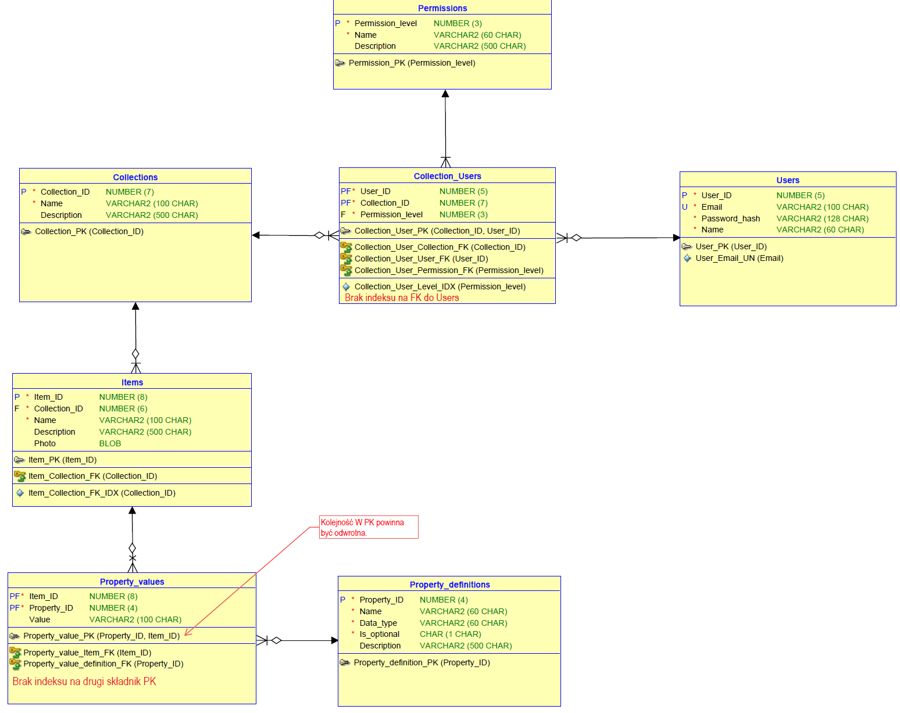

## Schemat bazy danych przedstawiony do pierwszych konsultacji (ERD)

## Schemat bazy danych po wykonaniu poprawek
Po uwzględnieniu uwag pana dr. inż. Tomasza Traczyka do drugiego etapu konsultacji przesłaliśmy następujące schematy

### ERD

### Struktura relacyjna

## Informacja zwrotna po ocenie śródsemestralnej
Do schematu przesłanego w drugim etapie konsultacji otrzymaliśmy następujące uwagi

Problemy te zostaną poprawione przed ostatnim terminem konsultacji

## Dodatkowe informacje
* wybrana baza danych to Oracle dostarczone nam przez Politechnikę Warszawską
* do połączenia z bazą zostanie wykorzystane SQLAlchemy (ORM)
